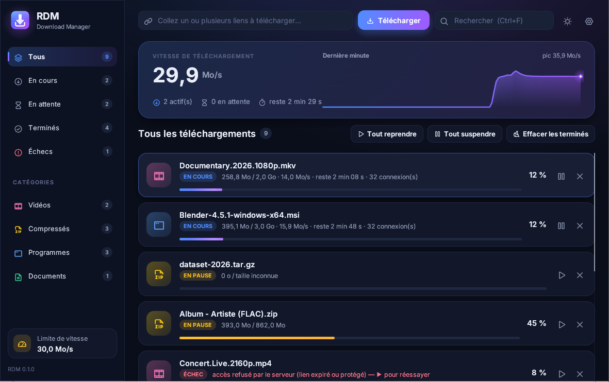
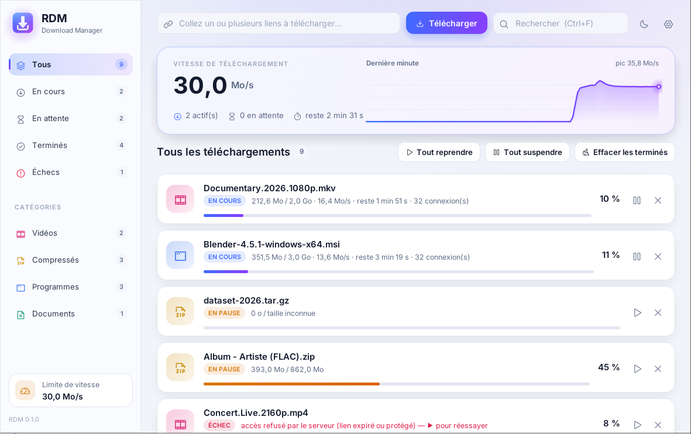
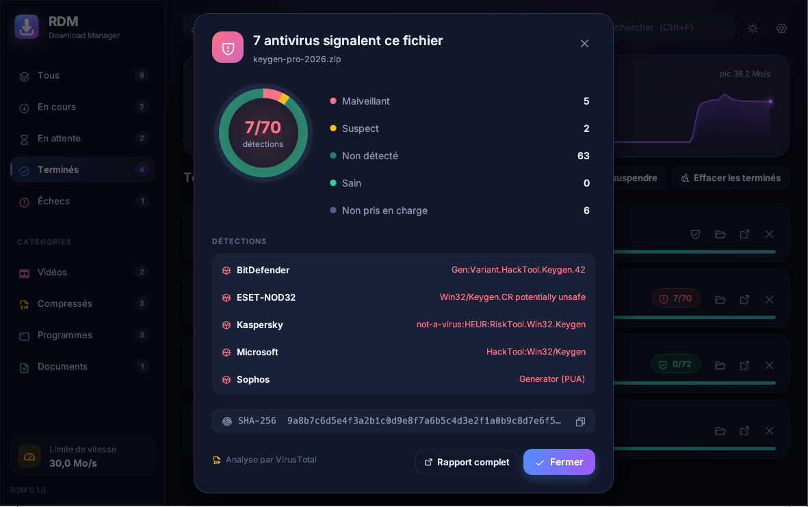
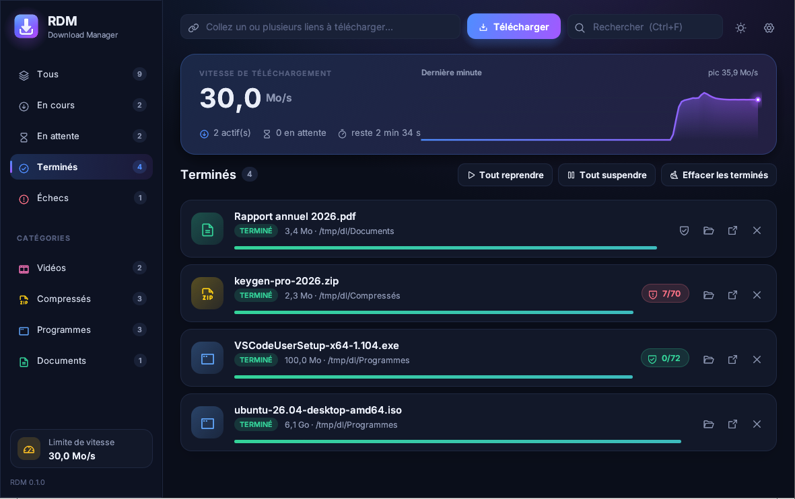
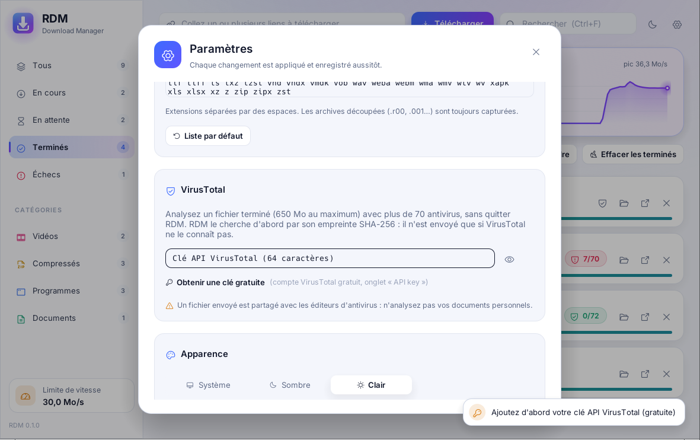
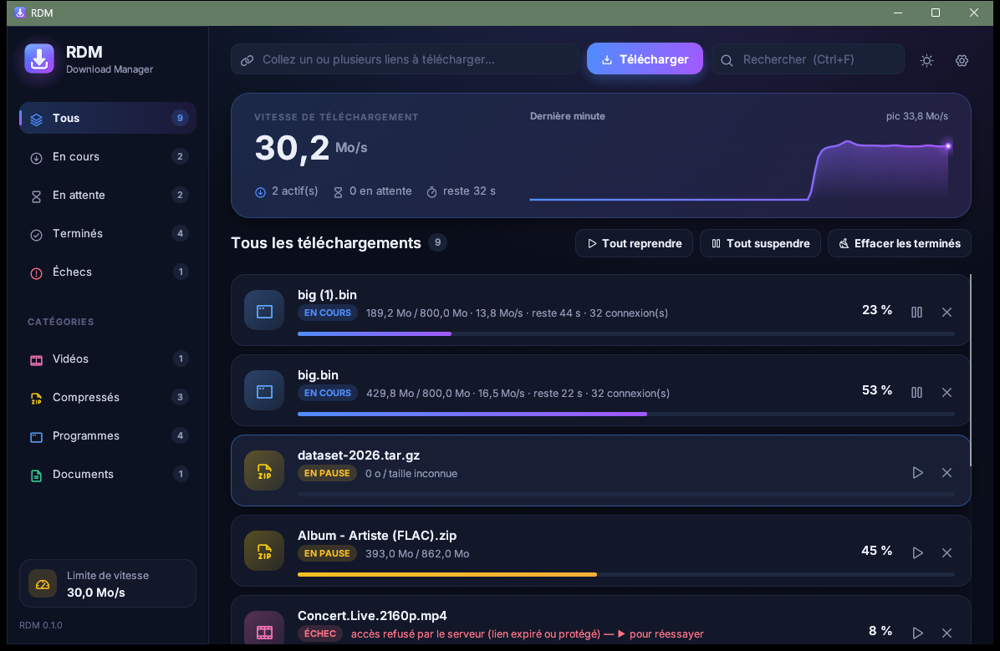

<p align="center">
  
</p>

<h1 align="center">RDM — Rust Download Manager</h1>

<p align="center">
  Gestionnaire de téléchargements rapide, beau et open source, pour <b>Windows 11</b> et <b>Linux</b>.<br>
  Jusqu'à 64 connexions par fichier, extension de navigateur, vidéos et YouTube, analyse VirusTotal intégrée.
</p>

<p align="center">
  <a href="https://github.com/vincentxjoubert-lang/rdm/releases/latest"></a>
  <a href="https://github.com/vincentxjoubert-lang/rdm/releases"></a>
  <a href="https://github.com/vincentxjoubert-lang/rdm/actions"></a>
  
  <a href="LICENSE"></a>
</p>

<p align="center">
  
</p>

## Télécharger

| Système | Fichier | Installation |
|---|---|---|
| **Windows 10 / 11** | [`RDM-x.y.z-x64-setup.msi`](https://github.com/vincentxjoubert-lang/rdm/releases/latest) | Double-clic. Installé pour votre compte (sans droits administrateur), menu Démarrer et **Bureau**. Un RDM ouvert est fermé proprement puis relancé. Les mises à jour suivantes s'installent depuis RDM. |
| **Ubuntu 26.04** | code source | `sh install-ubuntu.sh` (voir [Installation](#installation)) : icône dans les applications GNOME, démarrage automatique. |
| **Debian / Ubuntu** | [`rdm_*.deb`](https://github.com/vincentxjoubert-lang/rdm/releases/latest) | `sudo apt install ./rdm_*.deb` |
| **Fedora / openSUSE** | [`rdm-*.rpm`](https://github.com/vincentxjoubert-lang/rdm/releases/latest) | `sudo dnf install ./rdm-*.rpm` |
| **Linux (autres)** | [`rdm-linux-x64.tar.gz`](https://github.com/vincentxjoubert-lang/rdm/releases/latest) | Extraire, puis `sh install.sh` |
| **Chrome / Brave / Opera / Edge** | depuis RDM, ou [`rdm-chromium.zip`](https://github.com/vincentxjoubert-lang/rdm/releases/latest) | Voir [Extension](#extension-du-navigateur) |
| **Firefox / Waterfox** | depuis RDM, ou [`rdm-firefox.xpi`](https://github.com/vincentxjoubert-lang/rdm/releases/latest) | Voir [Extension](#extension-du-navigateur) |

## Aperçu

| Thème clair | Rapport VirusTotal |
|---|---|
|  |  |
| **Badges VirusTotal sur les fichiers terminés** | **Paramètres** |
|  |  |

<p align="center"><br><i>Sous Windows 11</i></p>

## Mises à jour

RDM cherche une nouvelle version sur ce dépôt au démarrage puis une fois par jour : une seule requête à l'API de GitHub, rien d'autre (désactivable dans **Paramètres → Mises à jour**, où un bouton « Rechercher maintenant » permet aussi de vérifier à la demande). Quand une version sort, une carte apparaît dans la barre latérale :

- **Windows** : un clic télécharge l'installateur depuis GitHub (avec reprises si la connexion coupe), le vérifie (taille et empreinte SHA-256 publiées par GitHub, format MSI), puis RDM se ferme et un assistant — une copie de RDM, sans PowerShell — attend sa fermeture réelle, installe (barre de progression, sans demande d'administrateur, journal `rdm-update-<version>.log` dans le dossier temporaire) et relance RDM. Si l'installation échoue, l'assistant le dit, propose de réessayer et relance l'ancienne version : RDM n'est jamais laissé fermé sans explication. Les téléchargements en cours sont mis en pause proprement et reprennent ensuite. Si le téléchargement de l'installateur échoue, la carte reste là pour réessayer.
- **Linux** : un clic ouvre la page de la version.

> **RDM 0.1.0 et 0.2.0** : leur installation automatique était défectueuse (RDM se fermait sans rien installer). Depuis la 0.2.1, ces versions ouvrent la page de la nouvelle version au lieu de se fermer : téléchargez `RDM-x.y.z-x64-setup.msi` et double-cliquez, **une seule fois** — l'installateur ferme RDM lui-même. Les mises à jour suivantes se font de nouveau en un clic.

## Architecture (DDD, couches)

| Crate / dossier  | Couche           | Rôle                                                                       |
|------------------|------------------|----------------------------------------------------------------------------|
| `crates/domain`  | Domaine          | Agrégat `Download` (états, transitions), `Segment`, catégories et formats  |
| `crates/engine`  | Infrastructure   | Moteur HTTP multi-connexions, HLS, fusion MP4, anti-SSRF, limiteur         |
| `crates/app`     | Application + UI | File d'attente, réglages, pont `127.0.0.1:9614`, interface egui, zone de notification |
| `extension/`     | Navigateur       | Chrome/Brave/Opera/Edge/Firefox MV3 : interception, détection vidéo, extracteur YouTube (embarquée dans RDM, qui l'installe) |

## Fonctions

- **Moteur** : jusqu'à 64 connexions par fichier (IDM : 32), segmentation dynamique (une connexion libre reprend la moitié du plus gros segment restant), pause/reprise.
- **Connexions adaptatives** : un téléchargement démarre avec 8 connexions, double chaque seconde tant que tout va bien, puis en ajoute une à la fois ; quand des connexions échouent (délai dépassé, coupure, serveur qui refuse avec 429/503), il en retire un quart (la moitié pour un refus) et rend leur part aux autres. Un Wi-Fi faible, une box saturée ou un serveur pointilleux trouvent ainsi leur rythme au lieu d'échouer en « délai dépassé ».
- **Coupures réseau** : la dernière connexion d'un téléchargement réessaie jusqu'à 3 minutes sans données (Wi-Fi qui décroche, mise en veille, serveur momentanément absent) ; au-delà, RDM remet le téléchargement dans la file et **réessaie seul** (après 5 s, 10 s, 20 s… puis toutes les 2 minutes, environ une demi-heure), en reprenant là où il s'était arrêté. La carte affiche la raison et le compte à rebours, avec un bouton « Réessayer maintenant ». Un serveur sans reprise possible recommence le fichier depuis le début (5 fois au plus).
- **Ajout instantané** : un lien envoyé par le navigateur apparaît aussitôt dans la liste ; le nom réel du fichier est demandé au serveur en arrière-plan (10 s au plus). Un même lien reçu deux fois en 5 s n'est ajouté qu'une fois.
- **Redémarrage** : les téléchargements en cours à la fermeture de RDM (ou à l'extinction) reprennent seuls au lancement suivant.
- **Vitesse** : fichiers creux (*sparse*) sous Windows (sans cela, NTFS remplit de zéros le fichier avant chaque segment éloigné : le disque écrivait tout deux fois et les connexions attendaient) ; pas de bridage « EcoQoS » de Windows 11 quand RDM est en arrière-plan ; threads réseau et disque en priorité supérieure à la normale sous Windows.
- **Reprise après coupure** : un point de reprise est enregistré toutes les 20 s pendant le téléchargement (données synchronisées d'abord). Un plantage, une extinction ou une fermeture de session ne fait perdre que les dernières secondes ; sous Linux, la fermeture de session (SIGTERM) arrête RDM proprement.
- **File d'attente** : N téléchargements simultanés (3 par défaut), les suivants démarrent seuls.
- **Limite de vitesse** globale.
- **Catégories** : Vidéos, Musique, Compressés, Programmes, Documents, Autres. Un dossier par catégorie, **modifiable** dans les paramètres.
- **Formats capturés** : plus de 150 extensions, liste modifiable dans les paramètres, archives découpées (`.r00`, `.001`…) toujours incluses.
- **HLS (`.m3u8`)** : choix de la qualité, **pistes audio séparées** fusionnées automatiquement, `EXT-X-BYTERANGE`, AES-128.
- **YouTube** : qualités « vidéo + audio » fusionnées en un seul `.mp4` sans réencodage, audio seul, flux HLS.
- **Interface** : tableau de bord avec la vitesse en direct et la courbe de la dernière minute, cartes par téléchargement (couleur par catégorie, barres de progression animées), police Inter et icônes Phosphor, thèmes clair et sombre (bascule en un clic), notifications discrètes dans la fenêtre. Recherche (**Ctrl+F**), filtres, temps restant ; clic droit pour ouvrir, afficher dans le dossier, copier le lien ou le chemin, **SHA-256**, supprimer ; double-clic pour ouvrir ; **Ctrl+V n'importe où**. La fenêtre rouverte garde sa taille, sa position et son état agrandi.
- **VirusTotal** : bouton « Analyser avec VirusTotal » sur les fichiers terminés de 650 Mo au plus (au-delà, VirusTotal refuse le fichier : pas de bouton). Voir ci-dessous.
- **Zone de notification** : RDM y reste quand on ferme la fenêtre (Ouvrir, Tout reprendre, Tout suspendre, Quitter) ; relancer RDM réaffiche la fenêtre. La fenêtre est alors réellement fermée (elle quitte la barre des tâches et libère sa mémoire graphique) et « Ouvrir » en recrée une, à la même taille (et à la même place, sauf sous Wayland qui ne le permet pas). Dans la zone de notification, RDM ne consomme aucun processeur. « Quitter » ferme RDM en toutes circonstances, même fenêtre minimisée ou bloquée.
- **Notification** à la fin d'un téléchargement ; **lancement au démarrage** (réduit).
- Mode portable : `RDM_CONFIG_DIR=<dossier>`.

Mesures sur un fichier de 100 Mo (intégrité vérifiée par SHA-256 contre `curl`) :

| | Débit |
|---|---|
| `curl`, 1 connexion | 1,8 Mo/s |
| RDM, 32 connexions | 49,4 Mo/s |
| RDM, 64 connexions | 83,9 Mo/s |

## VirusTotal

Le bouclier d'un fichier terminé (ou son clic droit) lance l'analyse, entièrement dans RDM : le site n'est jamais ouvert.

1. RDM calcule l'empreinte SHA-256 du fichier et la cherche chez VirusTotal. **Si le fichier est déjà connu, rien n'est envoyé** : le verdict s'affiche en quelques secondes.
2. Sinon, le fichier est envoyé (jusqu'à 650 Mo ; au-delà de 32 Mo par l'adresse d'envoi dédiée), avec la progression dans la carte, puis RDM attend le verdict (quelques minutes en général).
3. Le résultat apparaît sur la carte (« 0/72 » vert, ou le nombre d'antivirus qui signalent le fichier, en rouge) ; un clic ouvre le rapport : répartition des verdicts, liste des antivirus qui détectent quelque chose, empreinte. Une notification du bureau annonce aussi le verdict, qui est conservé d'une session à l'autre.

Il faut **une clé API gratuite** (une seule fois) : créer un compte sur virustotal.com, copier la clé depuis la page « API key », la coller dans **Paramètres → VirusTotal**. Le premier clic sur le bouclier sans clé ouvre directement ce réglage. L'API gratuite limite à 4 requêtes par minute : RDM fait les analyses une par une et patiente si le quota est atteint.

Vie privée : un fichier envoyé est partagé avec les éditeurs d'antivirus. N'analysez pas vos documents personnels. Le nom du fichier n'est pas transmis (seulement son extension).

## Extension du navigateur

**L'extension est embarquée dans RDM, qui l'installe.** Carte **Extension navigateur** de la barre latérale (ou **Paramètres → Navigateur → Installer l'extension…** ; la fenêtre s'ouvre seule au premier lancement) : RDM liste les navigateurs présents — Firefox, Waterfox, Chrome, Brave, Opera, Edge, Chromium — et ceux d'où l'extension lui parle (« Connectée »). **Installer** écrit l'extension dans un dossier fixe (`%LOCALAPPDATA%\RDM\Extension` sous Windows, `~/RDM/Extension` sous Linux, lisible par les navigateurs Snap et Flatpak), ouvre le navigateur sur sa page des extensions et affiche les deux clics restants, avec le chemin à copier. RDM tient ce dossier à jour : l'extension suit les nouvelles versions au redémarrage du navigateur.

**Chrome, Brave, Opera, Edge, Chromium** (Chromium 121 ou plus) : une seule et même extension. Sur la page des extensions → **Mode développeur** → **Charger l'extension non empaquetée** → le dossier indiqué par RDM. Sans RDM : `rdm-chromium.zip` de la page des versions (ou `sh packaging/chromium/build.sh`), à extraire puis charger de la même façon. Un `.crx` ne servirait à rien : Chrome, Brave et Edge n'installent les `.crx` que depuis leur boutique. L'identifiant de l'extension est fixe (`cgailhenfaoohkakpdacohcnmppepjjl`) et le pont local n'accepte que lui.

**Firefox** (version 140 ou plus) : Firefox n'installe durablement que les extensions **signées par Mozilla**.

- **Waterfox** (dérivé de Firefox, même extension) : **Installer** ouvre directement le paquet `rdm-firefox.xpi` dans Waterfox → **Ajouter**. Waterfox accepte les extensions non signées : elle est installée pour de bon (testé avec Waterfox 6.7). La même autorisation dans RDM que pour Firefox est demandée au premier échange. Après une mise à jour de RDM, « Réinstaller » passe l'extension à sa nouvelle version.
- Si la version publiée sur GitHub contient un `rdm-firefox.xpi` signé (la CI le signe quand les secrets `AMO_JWT_ISSUER` / `AMO_JWT_SECRET` d'un compte addons.mozilla.org gratuit sont définis ; l'extension n'est pas publiée pour autant), **Installer** le télécharge et Firefox propose de l'**Ajouter** : c'est définitif.
- Sinon, RDM ouvre `about:debugging` : **Charger un module complémentaire temporaire…** → `manifest.json` du dossier indiqué. Un module temporaire disparaît à la fermeture de Firefox. Firefox Developer Edition, Nightly, ESR (`xpinstall.signatures.required` à `false`) et LibreWolf installent durablement le fichier `rdm-firefox.xpi` que RDM écrit à côté.
- Firefox donne à chaque installation une origine aléatoire (`moz-extension://…`), qui ne peut pas être fixée comme sur Chrome : dès le chargement de l'extension, **RDM demande de l'autoriser** → **Autoriser**. Tant que ce n'est pas fait, l'icône de l'extension affiche un badge **!** et un message dans la page l'explique ; un clic sur l'icône fait réapparaître la demande (✕ la remet à 30 minutes ; **Refuser** la rejette jusqu'au redémarrage de RDM). RDM redemande après une réinstallation (ou à chaque redémarrage de Firefox pour un module temporaire).

Si RDM est fermé, le navigateur télécharge normalement.

- Les téléchargements aux formats capturés passent à RDM, avec les cookies et le referer (jamais en navigation privée). Un petit fichier que le navigateur a déjà fini de télécharger reste au navigateur (pas de double téléchargement). Si RDM est occupé et répond lentement, l'extension applique la dernière liste de formats connue plutôt que de laisser passer le fichier.
- Chaque envoi est confirmé par un petit message dans la page (« ✓ Envoyé à RDM : fichier.zip ») ; en cas d'échec, le message dit pourquoi (RDM fermé, extension à autoriser) et le navigateur garde le téléchargement.
- L'extension se signale à RDM toutes les 5 minutes tant que le navigateur est ouvert : la fenêtre des extensions de RDM sait ainsi quels navigateurs sont connectés.
- Les envois explicites (bouton ⬇, clic droit) utilisent les cookies de l'onglet lui-même : fenêtre privée et conteneurs Firefox ne mélangent jamais leurs cookies avec ceux de la session normale.
- Au survol d'une vidéo, le bouton **⬇** ouvre la liste des qualités.
- Clic droit sur un lien, une vidéo ou un son → **Télécharger avec RDM**. Le bouton de l'extension affiche la fenêtre RDM.

### YouTube

Le menu ⬇ propose deux méthodes, testées de bout en bout dans un vrai navigateur :

1. **Téléchargement direct** (quelques secondes) : l'extension interroge l'API de lecture de YouTube depuis la page, avec la session du navigateur, via plusieurs profils de client. RDM **vérifie chaque lien, du premier au dernier octet**, avant de l'afficher : YouTube sert parfois le début d'un fichier puis refuse la suite (403) quand il manque son jeton anti-robot. Seuls les liens entièrement téléchargeables sont proposés, avec l'image et le son fusionnés sans réencodage.
2. **Enregistrement** (toujours disponible, environ la moitié de la durée de la vidéo) : la page se recharge en mode enregistrement, la vidéo est lue muette à 2× (vitesse officielle de YouTube), en qualité maximale, et RDM reçoit exactement les données que le lecteur de YouTube reçoit. Aucun jeton n'est fabriqué et aucune protection n'est contournée. Les publicités ne sont pas enregistrées. Un bandeau affiche la progression et permet d'annuler.

Non pris en charge : les contenus DRM (Netflix, Widevine, FairPlay) et la fusion des flux WebM (VP9/Opus). L'enregistrement force le lecteur en MP4 (H.264/AV1 + AAC).

## Sécurité et vie privée

- **Aucune télémétrie**. Seule connexion non demandée : la recherche de mise à jour (une requête à l'API GitHub par jour, désactivable).
- **Cookies jamais écrits sur le disque** (mémoire uniquement). Les cookies `SameSite=Strict` ne sont envoyés que pour un lien du même site que la page, comme le fait un navigateur.
- **Pont local** `127.0.0.1` : seule **notre** extension est acceptée (identifiant épinglé sur Chrome, autorisation explicite dans RDM sur Firefox) ; contrôle de `Host` (anti-DNS rebinding) ; corps de requête limité à 64 Ko ; URL http(s) uniquement.
- **Anti-SSRF** : une redirection ou une playlist venue d'Internet ne peut pas viser le réseau local (box, NAS, imprimante…).
- **Noms de fichiers assainis** : pas de `../`, pas de noms réservés Windows, longueur bornée.
- **Mark-of-the-Web** (Windows) : SmartScreen avertit avant d'exécuter un fichier téléchargé, sans enregistrer l'URL d'origine.
- **Intégrité** : chaque réponse partielle est vérifiée (`Content-Range`) ; les états de reprise sont validés (segments contigus, sans trou) et écrits de façon atomique ; les réponses vides ou tronquées ne sont jamais déclarées « terminées ».
- **Robustesse** : taille des playlists et des segments bornée ; parseur MP4 testé contre des entrées tronquées ou corrompues.
- TLS via rustls (pas d'OpenSSL) ; dépendances auditées avec `cargo audit`.

## Build et tests

```sh
cargo clippy --workspace --all-targets -- -D warnings
cargo test --workspace
cargo build --release
sh extension/test/check.sh        # extension (Node ≥ 20), manifestes et paquets Chromium et Firefox compris
```

Dépendances de compilation sous Linux : un compilateur C et `pkg-config` (`sudo apt install build-essential pkg-config` ou `sudo dnf install gcc pkg-config`). Aucune bibliothèque GTK n'est nécessaire.

## Installation

**Ubuntu 26.04, en une commande** (depuis le dossier du projet) :

```sh
sh install-ubuntu.sh
```

Le script installe les outils de compilation et, si besoin, Rust (rustup), compile RDM, l'installe pour votre compte avec son icône dans les **applications GNOME** (touche Super → « RDM ») et sur le **Bureau** (quand il affiche des icônes), le **lance à chaque ouverture de session** (réduit dans la zone de notification) et le démarre. `sudo` ne sert qu'aux paquets système manquants. Désinstaller : `sh install-ubuntu.sh --uninstall` (les réglages sont conservés).

| Système | Installer | Désinstaller |
|---------|-----------|--------------|
| Windows | `powershell -ExecutionPolicy Bypass -File packaging\windows\install.ps1` | `… install.ps1 -Uninstall` |
| Ubuntu  | `sh install-ubuntu.sh` | `sh install-ubuntu.sh --uninstall` |
| Linux   | `sh packaging/linux/install.sh [--autostart]` | `sh packaging/linux/install.sh --uninstall` |
| Debian/Ubuntu | `cargo install cargo-deb && cargo deb -p rdm` → `sudo apt install ./target/debian/rdm_*.deb` | `sudo apt remove rdm` |
| Fedora | `cargo install cargo-generate-rpm && cargo build --release && cargo generate-rpm -p crates/app` → `sudo dnf install ./target/generate-rpm/rdm-*.rpm` | `sudo dnf remove rdm` |

`install.sh` installe RDM dans `~/.local` (sans droits administrateur). Il installe aussi avec `sudo` les bibliothèques système **manquantes** : Wayland/X11, EGL, xkbcommon, le portail de bureau (boîtes de dialogue de fichiers) et, sous GNOME, l'extension de zone de notification. Il prend en charge apt, dnf, zypper et pacman. Si le binaire est absent et que Rust est installé, il compile RDM. Option `--no-deps` pour ne rien installer au niveau du système. Vérifié sur Ubuntu 26.04 (GNOME) et Fedora 44 (KDE Plasma).

Icônes : les deux sources vectorielles sont dans `crates/app/assets/icon/` (`rdm-small.svg`, plus épaisse, sert jusqu'à 32 px). `python3 packaging/icons/render.py` régénère toutes les tailles : `.ico` Windows, icônes Linux (16 à 512 px + SVG), icônes de l'extension, images de la fenêtre et de la zone de notification.

La CI GitHub (`.github/workflows/release.yml`) compile, lint, teste (Rust et extension, `web-ext lint` pour Firefox), audite les dépendances, puis produit les binaires Windows et Linux, le `.deb`, le `.rpm`, `rdm-chromium.zip` et `rdm-firefox.xpi` (signé par Mozilla quand les clés AMO sont configurées).
